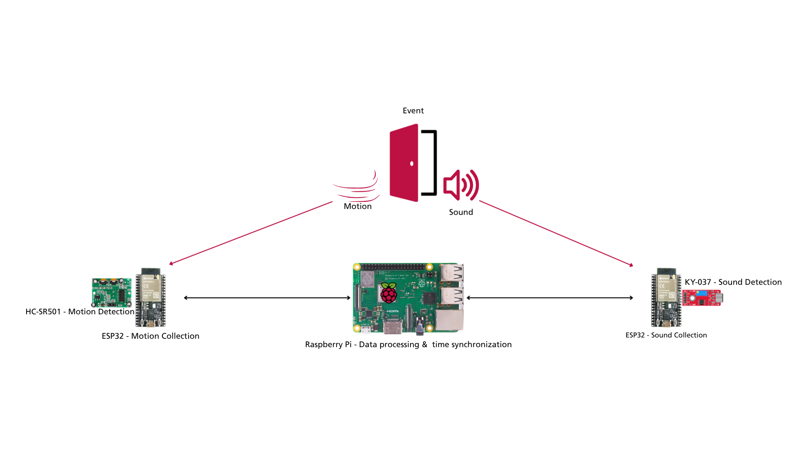

# Timing Synchronization Via Sensing

**ECE 535/635 - Networked Embedded Systems Design · UMass Amherst** 
**Instructor:** Fatima Anwar  
**Team:** Vytas Subacius, Phu Nguyen, Liam Earle, Sze Nga Wong  

We aim to develop a resource-efficient time synchronization protocol than existed timing services, hoping to contribute to the future world of network embedded systems with our experience in embedded systems, Linux, and machine learning (ML).

---

## 1. Motivation

In recent years, smart devices and connected technologies have become increasingly integrated into everyday life. From smart homes to autonomous vehicles, these technologies require network communication and time synchronization to operate reliably and efficiently. However, existing timing services can place a significant burden on devices with limited resources. Therefore, we want to leverage this time-stamped sensor data to synchronize the sensing devices.

**Our idea:** We will utilize ESP32 to collecting data from a sound and a motion sensor then Raspberry Pi will received and run the synchronization protocol.

## 2. Design Goals

| Goal | Description |
|---|---|
| **Processor Efficiency** | Real time processing on Raspberry Pi < 5%, ESP32 CPU Usage < 1% |
| **Precision** | +/- 1 ms |
| **Network Usage** | Low Bandwidth
| **Power Efficiency** | Low Power Usage

## 3. Deliverables

1. **Deliverable 1** - Characterize network delay between Raspberry Pi and the edge device
2. **Deliverable 2** - Estimate the relative clock drive between devices
3. **Deliverable 3** - Visualization of delay, offset, and drift relative to time 

## 4. System Blocks

## 5. Hardware / Software Requirements

### Hardware
| Item | Qty | Purpose |
|---|---|---|
| ESP32 | 2 | Collecting Data From Sensors |
| Raspberry Pi | 1 | Received and Run Synchronization Protocol |
| KY-037 | 1 | Sound Detection |
| HC-SR501 | 1 | Motion Detection|
| Breadboards & Jumper Cables | — | Connect Components |

### Software
- **Computer:** ArduinoIDE, C/C++, Python
- **Raspberry Pi:** Linux/Ubuntu, Python 
- **Collaboration:** Git/Github

## 6. Team Members and Responsibilities

Lead roles to assign: **Setup, Software, Networking, Writing, Research, Algorithm Design** (each member leads one or two; everyone contributes across the project).

| Member | Lead role(s) | Responsibilities |
|---|---|---|
| Sze Nga Wong | **Hardware Setup**, **Software** | Building sensing and timestamp hardware  |
| Liam Earle | **Networking**, **Software** | Implement BLE links between ESP32 and Pi and network characterization |
| Phu Nguyen | **Algorithm Design**, **Software** | Designing Synchronization Algorithm and implementation |
| Vytas Subacius | **Writing & Research**, **Software**| Research related work and implement software   |

## 7. Project Timeline

| Week | Dates | Milestone |
|---|---|---|
| 1 | [Sep 28 – Oct 3] | Team formed, project selected, repo submitted on Canvas (**Oct 3**) |
| 2 | Oct 5 | [Milestone] |
| 3 | [Dates] | [Milestone] |
| 4 | [Dates] | [Milestone] |
| 5 | [Dates] | [Milestone — Deliverable 1] |
| 6 | [Dates] | [Milestone — Deliverable 2] |
| 7 | [Dates] | [Milestone — project check-in] |
| 8 | [Dates] | [Milestone] |
| 9 | [Dates] | [Milestone] |
| 10 | [Dates] | [Visualizations, demo prep, report draft] |
| 11 | [Dates] | **Final demo and report** |

## 8. References

**Provided project references**
1. [Adeel Nasrullah; Fatima M Anwar], "[HAEST: harvesting Ambient Events to Synchronize Time across Heterogeneous loT Devices]," *[IEEE]*, [2024].
2. [Lex Fridman a; Daniel E. Brown a; William Angell a; Irman Abdić a; Bryan Reimer a, Hae Young Noh], "[Automated Synchronization of Driving Data Using Vibration and Steering Events]," *[ScienceDirect]*, [2016].
3. [Sandeep Singh Sandha; Joseph Noor; Fatima M. Anwar; Mani Srivastava], "[Exploiting Smartphone Peripherals for Precise Time Synchronization]," *[IEEE]*, [2019].
