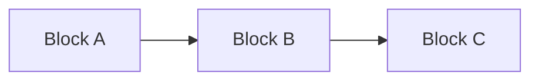

# Timing Synchronization Via Sensing

**ECE 535/635 - Networked Embedded Systems Design · UMass Amherst** 
**Instructor:** Fatima Anwar  
**Team:** Vytas Subacius, Phu Nguyen, Liam Earle, Sze Nga Wong  

We aim to develop a resource-efficient time synchronization protocol than existed timing services, hoping to contribute to the future of network embedded systems world with our experience in embedded systems, Linux, and machine learning (ML).

---

## 1. Motivation

In recent years, smart devices and connected technologies have become increasingly integrated into everyday life. From smart homes to autonomous vehicles, these technologies require network communication and time synchronization to operate reliably and efficiently. However, existing timing services can place a significant burden on devices with limited resources.

[Paragraph 2 — Why existing solutions fall short: What do current approaches cost or assume that doesn't fit the target devices or setting?]

[Paragraph 3 — The opportunity: What existing resource, data, or observation can be leveraged instead?]

**Our idea:** [One or two sentences stating the core approach of the project.]

## 2. Design Goals

| Goal | Description |
|---|---|
| **[Goal 1 name]** | [What the system must achieve and how you'll know it did.] |
| **[Goal 2 name]** | [Description] |
| **[Goal 3 name — accuracy/performance target]** | [Quantitative target, e.g., "< X ms error after Y minutes."] |
| **[Goal 4 name]** | [Description] |
| **[Goal 5 name — robustness]** | [Description] |

## 3. Deliverables

1. **[Deliverable 1 — from the project description]:** [What exactly will be produced and how it will be measured.]
2. **[Deliverable 2 — from the project description]:** [Description]
3. **[Deliverable 3 — core system/protocol]:** [Description]
4. **[Deliverable 4 — evaluation setup]:** [Description]
5. **[Deliverable 5 — visualizations / demo]:** [What the final demo will show.]
6. **[Deliverable 6 — final report and documented code]**

## 4. System Blocks

[Insert block diagram here — Mermaid diagram, image (``), or ASCII.]

### Block descriptions

- **[Block 1 name]:** [What it does, what runs on it, inputs/outputs.]
- **[Block 2 name]:** [Description]
- **[Block 3 name]:** [Description]
- **[Block 4 name]:** [Description]
- **[Block 5 name]:** [Description]

## 5. Approach and Evaluation Plan

**Phase A: [Phase name, e.g., Baselines and characterization]**
- [Step / experiment]
- [Step / experiment]

**Phase B: [Phase name, e.g., Core system implementation]**
- [Step / experiment]
- [Step / experiment]

**Metrics**
- [Metric 1, e.g., error vs. ground truth: mean / 95th percentile / max]
- [Metric 2]
- [Metric 3]
- [Metric 4]

## 6. Hardware / Software Requirements

### Hardware
| Item | Qty | Purpose |
|---|---|---|
| ESP32 | 1 | Collecting data from sensors |
| Raspberry Pi | 1 | Run synchronization protocol |
| [Sensor] | [#] | [Purpose] |
| [Sensor *(optional)*] | [#] | [Purpose] |
| [Misc: cables, breadboards, power] | — | [Purpose] |

### Software
- **[Component 1, e.g., device firmware]:** [Language, framework, libraries]
- **[Component 2, e.g., gateway/server]:** [Language, libraries]
- **[Component 3, e.g., analysis/visualization]:** [Tools]
- **Collaboration:** [e.g., Git/GitHub, issue tracker, shared drive]

## 7. Team Members and Responsibilities

Lead roles to assign: **Setup, Software, Networking, Writing, Research, Algorithm Design** (each member leads one or two; everyone contributes across the project).

| Member | Lead role(s) | Responsibilities |
|---|---|---|
| [Name 1] | **[Role]**, **[Role]** | [Specific tasks this person owns] |
| [Name 2] | **[Role]** | [Specific tasks] |
| [Name 3] | **[Role]** | [Specific tasks] |
| [Name 4] | **[Role]**, **[Role]** | [Specific tasks] |

## 8. Project Timeline

| Week | Dates | Milestone |
|---|---|---|
| 1 | [Sep 28 – Oct 3] | Team formed, project selected, repo submitted on Canvas (**Oct 3**) |
| 2 | [Dates] | [Milestone] |
| 3 | [Dates] | [Milestone] |
| 4 | [Dates] | [Milestone] |
| 5 | [Dates] | [Milestone — Deliverable 1] |
| 6 | [Dates] | [Milestone — Deliverable 2] |
| 7 | [Dates] | [Milestone — project check-in] |
| 8 | [Dates] | [Milestone] |
| 9 | [Dates] | [Milestone] |
| 10 | [Dates] | [Visualizations, demo prep, report draft] |
| 11 | [Dates] | **Final demo and report** |

## 9. References

**Provided project references**
1. [Author(s)], "[Title]," *[Venue]*, [Year].
2. [Author(s)], "[Title]," *[Venue]*, [Year].
3. [Author(s)], "[Title]," *[Venue]*, [Year].

**Additional related work**

4. [Author(s)], "[Title]," *[Venue]*, [Year].
5. [Author(s)], "[Title]," *[Venue]*, [Year].

**Tools / documentation**

6. [Tool or documentation name], [URL]
7. [Tool or documentation name], [URL]
